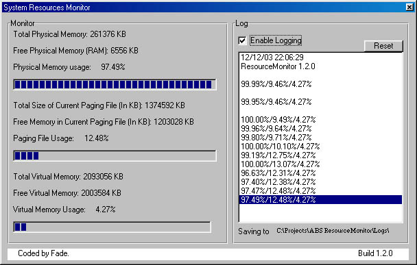

<div align="center">

## System Resource Monitor


</div>

### Description

Monitor System resources & memory & log to Memory & File. Complete solution, including internal Log Handeling with easy-to-use interface, Plus file system methods.
 
### More Info
 


<span>             |<span>
---                |---
**Submitted On**   |2003-12-12 22:03:40
**By**             |[Fade \(Amit Ben Shahar\)](https://github.com/Planet-Source-Code/PSCIndex/blob/master/ByAuthor/fade-amit-ben-shahar.md)
**Level**          |Intermediate
**User Rating**    |5.0 (10 globes from 2 users)
**Compatibility**  |VB 5\.0, VB 6\.0
**Category**       |[Miscellaneous](https://github.com/Planet-Source-Code/PSCIndex/blob/master/ByCategory/miscellaneous__1-1.md)
**World**          |[Visual Basic](https://github.com/Planet-Source-Code/PSCIndex/blob/master/ByWorld/visual-basic.md)
**Archive File**   |[System\_Res16830912122003\.zip](https://github.com/Planet-Source-Code/fade-amit-ben-shahar-system-resource-monitor__1-50424/archive/master.zip)

### API Declarations

```
Public Declare Sub GlobalMemoryStatus Lib "kernel32" (lpBuffer As MemoryStatus)
```


